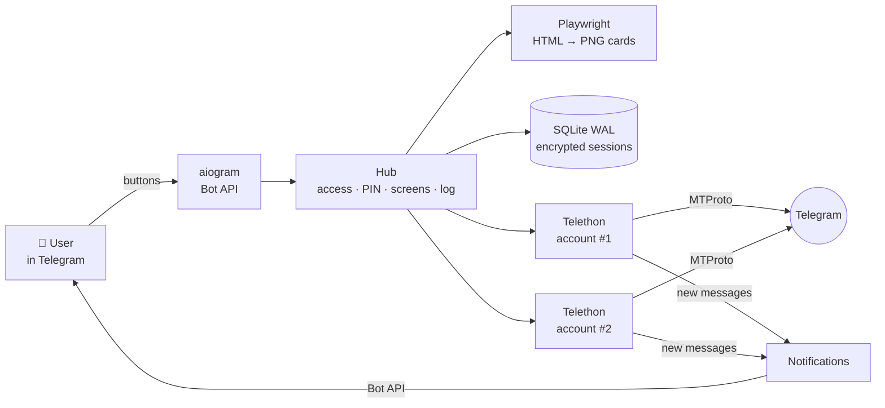

<p align="center">
  
</p>

<h1 align="center">Account Hub</h1>

<p align="center">
  <b>A Telegram bot that turns several of your own Telegram accounts into one panel</b><br>
  <sub><a href="README.md">Русский</a> · English</sub>
</p>

<p align="center">
  <a href="https://github.com/leath0r/account-hub/actions/workflows/tests.yml"></a>
  <a href="https://github.com/leath0r/account-hub/releases/latest"></a>
  <a href="LICENSE"></a>
  
  
  
  
</p>


> The screenshots show the Russian UI. The bot itself speaks **Russian and English**: it picks the language from your Telegram client and has a «🌐 Язык / Language» button. See the last screenshot for the English UI.

## ✨ Features

**Messaging**
- 🗂 **Several accounts in one chat.** Pick an account and act as it: chats, groups, channels, contacts.
- 🔔 **Push notifications for new messages** with *Open*, *Reply* and *Mark read* buttons. Messages that arrive within a few seconds come as one notification. Groups notify only on mentions (unless you turn on all messages). Notifications are silent at night.
- 📥 **Inbox.** Unread chats from every account in one feed, with *Mark all read* and *📌 Mark as unread* buttons.
- ✍️ **Replies as the account:** text, photos, voice messages, videos and files. **Write first** by `@username`, a `t.me/…` link or a contact. It has a daily limit so the account doesn't get spam-blocked.
- 🎤 **Every kind of attachment:** voice messages, round videos, videos, GIFs, music, documents, stickers and photos. The bot sends them to you as they are, one tap each.
- 😊 **Reactions**, ↪ **forwarding** to any chat, **even from another account**, and 🗑 **deleting** for everyone or just for the account.
- 🔎 **Search across all accounts at once** or within one account: chat titles and message text. A `@username` search shows which accounts already have a chat with that person.
- 🖼 **Chat avatars** right on the list card.

**Access & security**
- 👥 **Access for other people.** Roles are per account: 👁 read-only or ✍️ read & reply. You can also ban users and have several admins.
- 🔒 **PIN for dangerous actions:** deleting a message, *write first*, forwarding, logging an account out and removing it. After a correct PIN the bot won't ask again for 5 minutes. 5 wrong attempts lock input for 10 minutes.
- 🔐 **Log in with buttons.** You type the code on a keypad, because Telegram burns a code that is sent as a message. The bot deletes the phone number and the 2FA password from the chat right away.
- 📜 **Audit log & 📊 stats.** The log shows who opened what, who replied to whom, what was deleted and who got access. Stats show activity per account and per person for a day, week or month.
- 🟠 **Session lost?** The account is marked *Login needed* and admins get a *Log in again* button.

**Also**
- 🌐 **Russian and English UI.**
- 🐳 **Docker**, or plain systemd on your own server. If Telegram is blocked, the bot works through a proxy.

<p align="center"></p>

## 📸 Screens

One screen is one message: a card, a caption and buttons. The bot doesn't flood the chat; it redraws that message.

| | | |
|:---:|:---:|:---:|
| **Home** | **Account menu** | **Chats with avatars** |
|  |  |  |
| **Conversation & attachments** | **Reaction** | **Forward from another account** |
|  |  |  |
| **Push notification** | **Inbox from all accounts** | **Search across all accounts** |
|  |  |  |
| **@username → write first** | **My settings** | **PIN for dangerous actions** |
|  |  |  |
| **Adding an account** | **Admin panel** | **User access** |
|  |  |  |
| **Stats** | **English UI** | |
|  |  | |

<sub>The screenshots come from the real bot code running on the test stand; accounts and chats are made up. Regenerate: <code>cd hub && python tests/screenshots.py</code>.</sub>

## 🧩 How it works



- **The bot and all Telethon clients run in one asyncio process.** There is no Redis and no queue, just SQLite in WAL mode.
- **One screen = one message.** Each card is rendered from an HTML template (Unbounded + Manrope fonts) to a 1280×640 PNG. Identical cards aren't rendered twice: their `file_id` is cached in the database.
- **Access is checked on every tap.** A middleware checks the `account_id` from the button against the database, so forging `callback_data` gets you nowhere. A second middleware asks for the PIN before dangerous actions and then runs the original tap.
- **The bot is gentle with accounts:** at most 1 message per 2 s per account and a daily cap on new chats. It explains FloodWait and spam-block errors in plain words.
- **Translations:** the translation key is the Russian string from the code, and the English strings live in `i18n_en.py`. A CI check makes sure every UI string has a translation.

## 🚀 Quick start

You need a bot token from [@BotFather](https://t.me/BotFather) and your own `api_id`/`api_hash` from [my.telegram.org](https://my.telegram.org) (API development tools).

### Docker

```bash
git clone https://github.com/leath0r/account-hub.git && cd account-hub
mkdir data && cp hub/.env.example data/.env   # fill in BOT_TOKEN, API_ID, API_HASH, ADMIN_IDS
docker compose up -d --build
docker compose logs -f
```

Everything that changes (`.env`, database, log) lives in `./data`, so that's the only folder to back up. If your proxy to Telegram runs on the host, uncomment `network_mode: host` in `docker-compose.yml`.

### Without Docker

You need Python 3.12+.

```bash
git clone https://github.com/leath0r/account-hub.git
cd account-hub/hub
pip install -r requirements.txt
python -m playwright install chromium   # on Windows the installed Edge is used instead
cp .env.example .env                     # fill in BOT_TOKEN, API_ID, API_HASH
python main.py
```

First admin: put your Telegram ID into `ADMIN_IDS`. If you leave it empty, the bot prints `/claim <code>` to the log; send that command to the bot.
Then in the bot: **/start → ⚙️ Admin panel → ➕ Add account**.

### `.env` settings

| Variable | What | Default |
|---|---|---|
| `BOT_TOKEN` | bot token from [@BotFather](https://t.me/BotFather) | — |
| `API_ID`, `API_HASH` | app credentials from my.telegram.org | — |
| `ADMIN_IDS` | admin Telegram IDs, separated by spaces or commas | empty → `/claim` |
| `TZ_OFFSET` | time zone for message times and quiet hours, hours from UTC | `3` |
| `NEW_CHATS_PER_DAY` | how many new chats an account may start per day, `0` = no limit | `20` |
| `PROXY` | `socks5://host:port` if Telegram isn't reachable directly | empty |
| `SESSION_KEY` | session encryption key, **generated automatically** on first run | — |

## 🖥 Your own server without Docker

`hub/deploy/` has everything to run the bot on a Linux server without root:

- **systemd `--user`**: the bot (restarts without limit), the proxy client and a daily database backup;
- **`hubctl`**: `status` · `restart` · `logs -f` · `claim` · `env` · `backup` · `selftest` · `proxy set|test|off`;
- **`hubctl proxy set`** takes an `hy2://`, `vless://` or `trojan://` link. It installs the client, checks that Telegram is reachable, and only then restarts the bot;
- **from a Windows PC**: `deploy.ps1` uploads the code and restarts the bot, and `hub.ps1 <command>` manages it. The server address is kept in `hub/deploy/server.local` (`user@host`), which is git-ignored.

## 🧪 Tests

```bash
cd hub
python tests/run_test.py 1500   # the stand: scenarios + 1500 random taps
python tests/i18n_check.py      # every UI string has an English translation
```

The stand fakes both Telegram (for Telethon) and the Bot API (for aiogram), so it needs no network, and the cards are rendered for real. It runs **about 150 checks**, including:
- login with a code and 2FA, FloodWait, roles and forged buttons;
- notifications (batching, mentions, muted chats) and every kind of attachment in both directions;
- reactions, forwarding between accounts, *mark all read* and search across accounts;
- PIN with lockout, the English UI, stats, restarts and a changed key;
- hundreds of random taps.

It also catches what breaks on real Telegram: captions over 1024 characters, texts over 4096, broken HTML, `callback_data` over 64 bytes, answering a callback twice. CI runs the stand on Python 3.12 and 3.14 and inside the Docker image.

## 🔐 Security

- Account sessions and phone numbers are **encrypted** in the database (Fernet); the key lives only in `.env`.
- The bot **deletes the phone number and the cloud password from the chat right away** and never stores the password. The login code is typed with buttons and never appears in the chat history.
- The PIN is stored only as a hash (PBKDF2-SHA256 with salt). An admin can reset a forgotten PIN.
- The bot only answers in private chats and only to people who have access. Notifications go only to people who can see the account.
- `.env`, the database, backups and logs never get into the repository (`.gitignore`, `.dockerignore`).

> Use the bot only with **your own** accounts, or with their owners' consent, and within Telegram's rules.

## 📁 Layout

| Path | What |
|---|---|
| `hub/main.py` | entry point: bot, accounts, notifications |
| `hub/tg.py` | Telethon clients: chats, messages, attachments, reactions, forwarding |
| `hub/notify.py` | push notifications for new messages |
| `hub/access.py`, `hub/screens/pin.py` | access checks on every tap, PIN |
| `hub/screens/` | screens: `home`, `account`, `lists`, `dialog`, `actions`, `media`, `search`, `inbox`, `admin`, `login` |
| `hub/i18n.py`, `hub/i18n_en.py` | translations |
| `hub/templates/` | HTML cards |
| `hub/deploy/` | systemd units, `hubctl`, proxy, deploy scripts |
| `hub/tests/` | the stand, translation check, screenshot generator |
| `Dockerfile`, `docker-compose.yml` | running in a container |
| `docs/` | screenshots and the demo for the README |
| `demo/`, `design/` | the first UI demo and card mockups |

See [CHANGELOG.md](CHANGELOG.md) for what changed between versions.

## 🗺 Next

- [ ] reply with a quote, edit your own messages
- [ ] monitor of active account sessions ("who else is logged in")
- [ ] canned replies and scheduled sending
- [ ] search inside one chat, Telegram folders

## License

[MIT](LICENSE)
