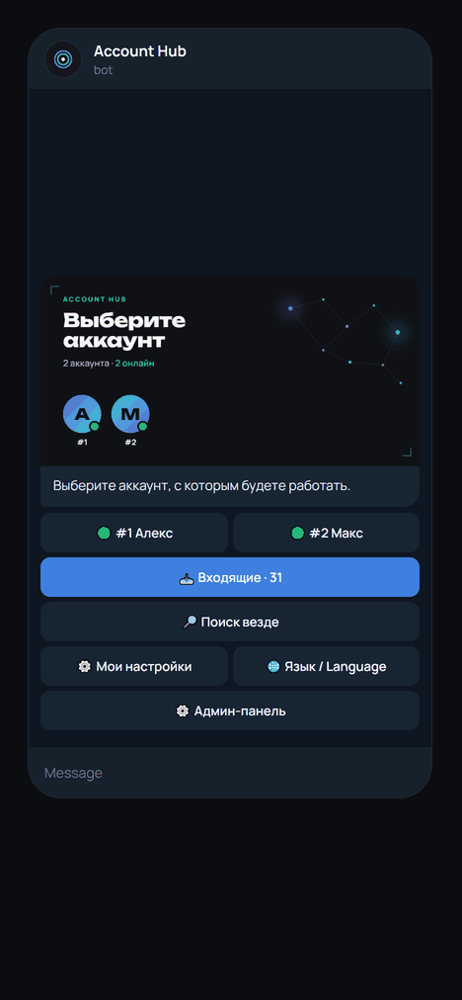
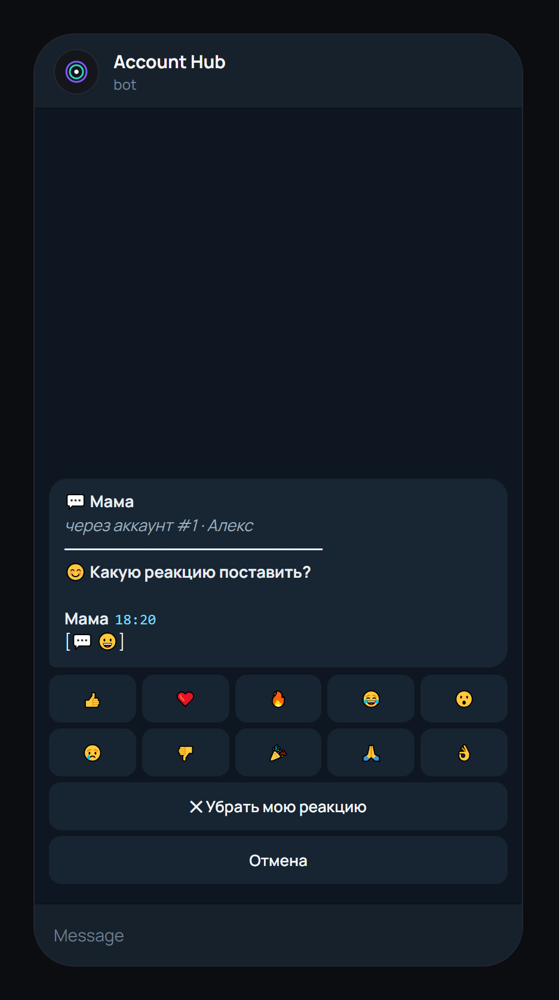
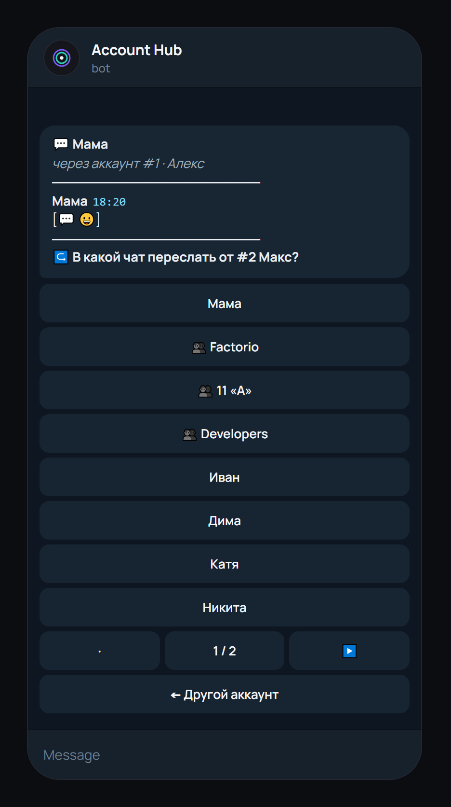
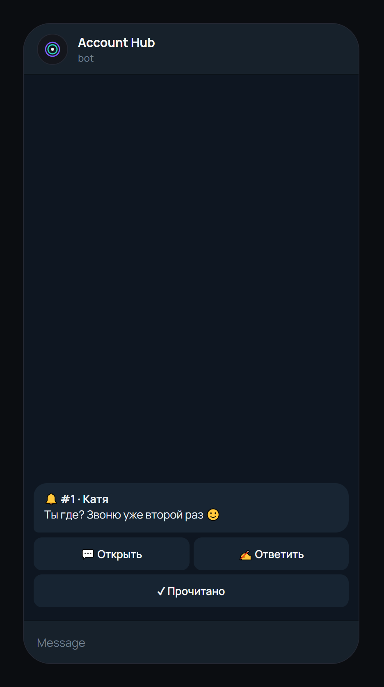
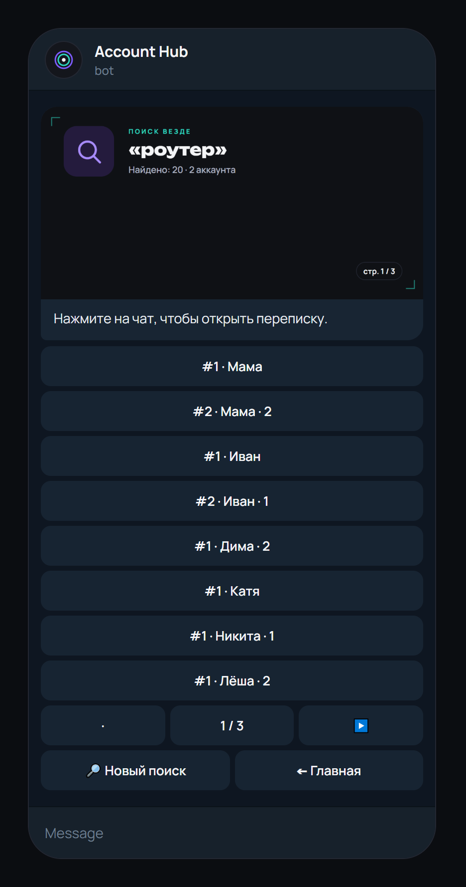
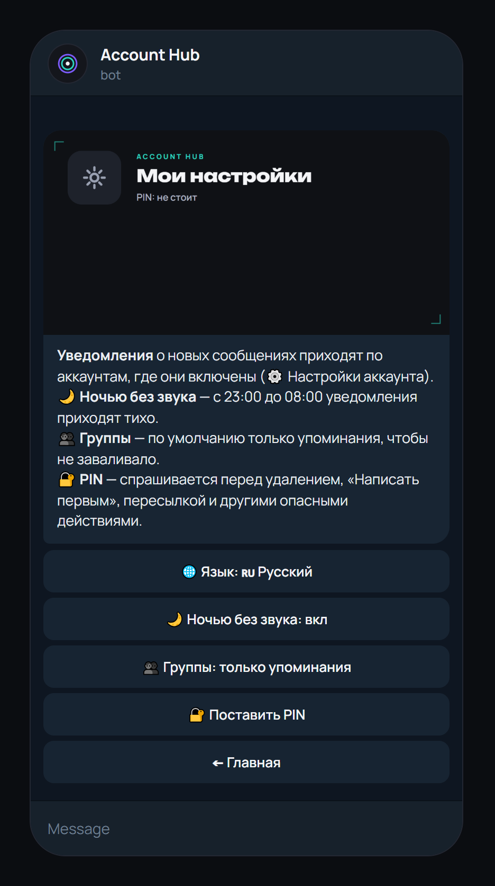
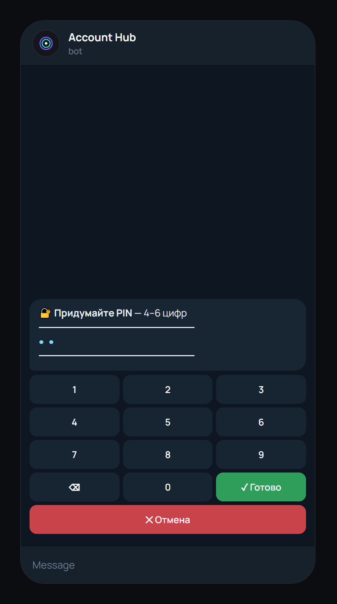
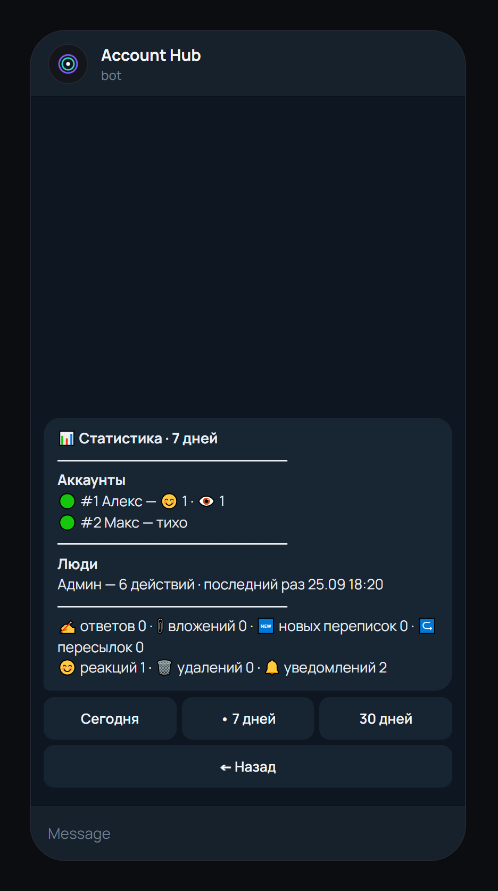
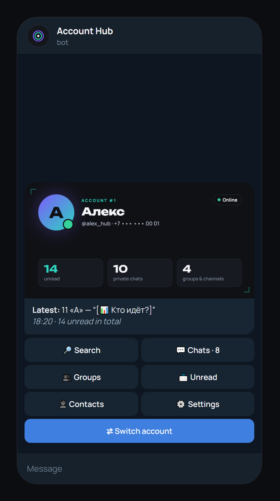
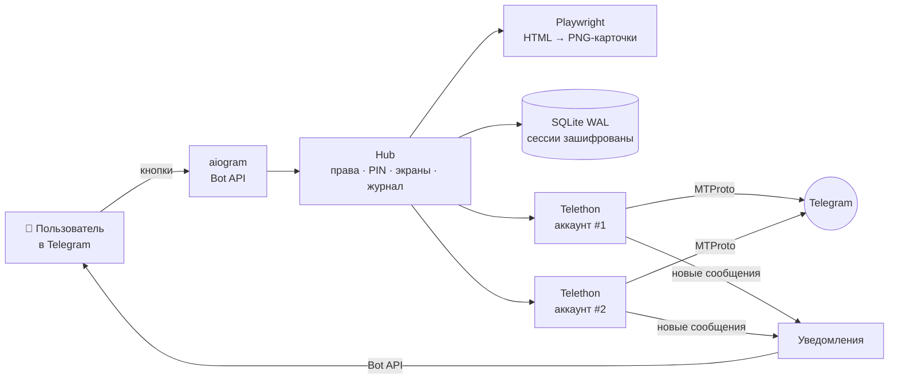

<p align="center">
  
</p>

<h1 align="center">Account Hub</h1>

<p align="center">
  <b>Telegram-бот: одна панель для нескольких своих Telegram-аккаунтов</b><br>
  <sub>Русский · <a href="README.en.md">English</a></sub>
</p>

<p align="center">
  <a href="https://github.com/leath0r/account-hub/actions/workflows/tests.yml"></a>
  <a href="https://github.com/leath0r/account-hub/releases/latest"></a>
  <a href="LICENSE"></a>
  
  
  
  
</p>


## ✨ Что умеет

**Переписка**
- 🗂 **Несколько аккаунтов в одном чате.** Выбираете аккаунт и работаете от его имени: чаты, группы, каналы, контакты.
- 🔔 **Пуш-уведомления о новых сообщениях** с кнопками «Открыть», «Ответить», «Прочитано». Сообщения за несколько секунд приходят одним уведомлением. Из групп приходят только упоминания (можно включить все), ночью уведомления без звука.
- 📥 **Входящие.** Непрочитанное со всех аккаунтов одной лентой. Есть кнопки «Прочитать всё» и «📌 Непрочитанным».
- ✍️ **Ответы от имени аккаунта:** текст, фото, голосовые, видео, файлы. **«Написать первым»** по `@username`, ссылке `t.me/…` или из контактов. У этой функции суточный лимит, чтобы аккаунт не получил спам-блок.
- 🎤 **Любые вложения из переписки:** голосовые, кружки, видео, GIF, музыка, документы, стикеры, фото. Бот присылает их по кнопке как есть.
- 😊 **Реакции**, ↪ **пересылка** в любой чат, в том числе **с другого аккаунта**, 🗑 **удаление** «у всех» или «только у себя».
- 🔎 **Поиск по всем аккаунтам сразу** или по одному. Ищет по названиям чатов и тексту сообщений; по `@username` показывает, где уже есть переписка.
- 🖼 **Аватарки чатов** прямо на карточке списка.

**Доступ и безопасность**
- 👥 **Доступ для других людей.** Роль задаётся на каждый аккаунт: 👁 чтение или ✍️ чтение и ответы. Есть бан и несколько админов.
- 🔒 **PIN на опасные действия:** удаление сообщения, «Написать первым», пересылка, выход из аккаунта и его удаление из панели. После верного PIN бот 5 минут его не спрашивает, после 5 ошибок ввод блокируется на 10 минут.
- 🔐 **Вход в аккаунт кнопками.** Код набирается на кейпаде, потому что Telegram сжигает код, отправленный сообщением. Номер и пароль 2FA бот сразу удаляет из чата.
- 📜 **Журнал и 📊 статистика.** Видно, кто что открыл, кому ответил, что удалил и кому выдал доступ. Отдельно показана активность по аккаунтам и людям за день, неделю или месяц.
- 🟠 **Слетела сессия?** Аккаунт помечается «Нужен вход», и админам приходит кнопка «Войти заново».

**Остальное**
- 🌐 **Русский и английский интерфейс.** Язык определяется по Telegram, сменить его можно кнопкой «🌐 Язык / Language».
- 🐳 **Docker** или обычный systemd на своём сервере. Если Telegram заблокирован, бот работает через прокси.

<p align="center"></p>

## 📸 Как выглядит

Один экран — одно сообщение: карточка, подпись и кнопки. Бот не засоряет чат, а перерисовывает это сообщение.

| | | |
|:---:|:---:|:---:|
| **Главная** | **Меню аккаунта** | **Чаты с аватарками** |
|  |  |  |
| **Переписка и вложения** | **Реакция** | **Пересылка с другого аккаунта** |
|  |  |  |
| **Пуш-уведомление** | **Входящие со всех аккаунтов** | **Поиск по всем аккаунтам** |
|  |  |  |
| **@username → написать первым** | **Мои настройки** | **PIN на опасные действия** |
|  |  |  |
| **Добавление аккаунта** | **Админ-панель** | **Доступы пользователя** |
|  |  |  |
| **Статистика** | **English** | |
|  |  | |

<sub>Скриншоты сняты с настоящего кода бота на тестовом стенде, аккаунты и переписки выдуманные. Пересоздать: <code>cd hub && python tests/screenshots.py</code>.</sub>

## 🧩 Как устроено



- **Бот и все Telethon-клиенты работают в одном asyncio-процессе.** Нет ни Redis, ни очередей, только SQLite в режиме WAL.
- **Экран = одно сообщение.** Карточка рендерится из HTML-шаблона (шрифты Unbounded + Manrope) в PNG 1280×640. Одинаковые карточки повторно не рендерятся: `file_id` кэшируется в базе.
- **Права проверяются на каждое нажатие.** Middleware всегда сверяет `account_id` из кнопки с базой, так что подделать `callback_data` бесполезно. Вторая middleware просит PIN перед опасными действиями и после ввода выполняет исходное нажатие.
- **Бот бережёт аккаунты:** не чаще 1 сообщения в 2 с на аккаунт и ограниченное число новых переписок в сутки. FloodWait и спам-блок бот объясняет понятным текстом.
- **Переводы:** ключ перевода — сама русская строка из кода, английские строки лежат в `i18n_en.py`. В CI отдельная проверка следит, чтобы у каждой строки интерфейса был перевод.

## 🚀 Быстрый старт

Понадобятся токен бота от [@BotFather](https://t.me/BotFather) и свои `api_id`/`api_hash` с [my.telegram.org](https://my.telegram.org) (раздел API development tools).

### Docker

```bash
git clone https://github.com/leath0r/account-hub.git && cd account-hub
mkdir data && cp hub/.env.example data/.env   # вписать BOT_TOKEN, API_ID, API_HASH, ADMIN_IDS
docker compose up -d --build
docker compose logs -f
```

Всё, что меняется (`.env`, база, лог), лежит в `./data`, поэтому бэкапить нужно только эту папку. Если прокси до Telegram работает на хосте, раскомментируйте `network_mode: host` в `docker-compose.yml`.

### Без Docker

Нужен Python 3.12+.

```bash
git clone https://github.com/leath0r/account-hub.git
cd account-hub/hub
pip install -r requirements.txt
python -m playwright install chromium   # на Windows вместо этого берётся установленный Edge
cp .env.example .env                     # вписать BOT_TOKEN, API_ID, API_HASH
python main.py
```

Первый админ: впишите свой Telegram ID в `ADMIN_IDS`. Если оставить поле пустым, бот напечатает в лог `/claim <код>` — отправьте эту команду боту.
Дальше в боте: **/start → ⚙️ Админ-панель → ➕ Добавить аккаунт**.

### Настройки `.env`

| Переменная | Что | По умолчанию |
|---|---|---|
| `BOT_TOKEN` | токен бота от [@BotFather](https://t.me/BotFather) | — |
| `API_ID`, `API_HASH` | ключ приложения с my.telegram.org | — |
| `ADMIN_IDS` | Telegram ID админов через пробел или запятую | пусто → `/claim` |
| `TZ_OFFSET` | часовой пояс для времени сообщений и тихих часов, часы от UTC | `3` |
| `NEW_CHATS_PER_DAY` | сколько новых переписок аккаунт может начать за сутки, `0` — без лимита | `20` |
| `PROXY` | `socks5://host:port`, если Telegram недоступен напрямую | пусто |
| `SESSION_KEY` | ключ шифрования сессий, **создаётся сам** при первом запуске | — |

## 🖥 Свой сервер без Docker

В `hub/deploy/` лежит всё для работы на Linux-сервере без root:

- **systemd `--user`**: бот (перезапуск без лимита), клиент прокси, ежедневный бэкап базы;
- **`hubctl`**: `status` · `restart` · `logs -f` · `claim` · `env` · `backup` · `selftest` · `proxy set|test|off`;
- **`hubctl proxy set`** принимает ссылку `hy2://`, `vless://` или `trojan://`: сам ставит клиент, проверяет, что Telegram открылся, и только потом перезапускает бота;
- **с Windows-ПК**: `deploy.ps1` выкладывает код и перезапускает бота, `hub.ps1 <команда>` управляет им. Адрес сервера хранится в `hub/deploy/server.local` (`user@host`) и в git не попадает.

## 🧪 Тесты

```bash
cd hub
python tests/run_test.py 1500   # стенд: сценарии + 1500 случайных нажатий
python tests/i18n_check.py      # у каждой строки интерфейса есть английский перевод
```

Стенд подменяет и Telegram (для Telethon), и Bot API (для aiogram), поэтому сеть не нужна, а карточки рендерятся по-настоящему. Он делает **около 150 проверок**, в том числе:
- вход с кодом и 2FA, FloodWait, роли и подделанные кнопки;
- уведомления (пачки, упоминания, заглушённые чаты) и все виды вложений в обе стороны;
- реакции, пересылку между аккаунтами, «Прочитать всё» и поиск по всем аккаунтам;
- PIN с блокировкой, английский интерфейс, статистику, перезапуск и смену ключа;
- сотни случайных нажатий.

Отдельно стенд ловит то, на чём падает настоящий Telegram: подпись длиннее 1024 символов, текст длиннее 4096, битый HTML, `callback_data` длиннее 64 байт, двойной ответ на кнопку. CI гоняет стенд на Python 3.12 и 3.14, а заодно внутри Docker-образа.

## 🔐 Безопасность

- Сессии аккаунтов и номера хранятся в базе **зашифрованными** (Fernet); ключ лежит только в `.env`.
- Номер телефона и облачный пароль бот **сразу удаляет из чата**, пароль нигде не сохраняется. Код входа вводится кнопками и в историю чата не попадает.
- PIN хранится только как хэш (PBKDF2-SHA256 с солью). Забытый PIN сбрасывает админ.
- Бот отвечает только в личке и только тем, кому выдан доступ. Уведомления получают только те, кто видит аккаунт.
- `.env`, база, бэкапы и логи в репозиторий не попадают (`.gitignore`, `.dockerignore`).

> Используйте бота только со **своими** аккаунтами или с согласия их владельцев, в рамках правил Telegram.

## 📁 Структура

| Путь | Что |
|---|---|
| `hub/main.py` | запуск: бот, аккаунты, уведомления |
| `hub/tg.py` | Telethon-клиенты аккаунтов: чаты, сообщения, вложения, реакции, пересылка |
| `hub/notify.py` | пуш-уведомления о новых сообщениях |
| `hub/access.py`, `hub/screens/pin.py` | права на каждое нажатие, PIN |
| `hub/screens/` | экраны: `home`, `account`, `lists`, `dialog`, `actions`, `media`, `search`, `inbox`, `admin`, `login` |
| `hub/i18n.py`, `hub/i18n_en.py` | переводы |
| `hub/templates/` | HTML-карточки |
| `hub/deploy/` | systemd-юниты, `hubctl`, прокси, скрипты выкладки |
| `hub/tests/` | стенд, проверка переводов, генератор скриншотов |
| `Dockerfile`, `docker-compose.yml` | запуск в контейнере |
| `docs/` | скриншоты и демо для README |
| `demo/`, `design/` | первое демо интерфейса и макеты карточек |

Что изменилось между версиями, описано в [CHANGELOG.md](CHANGELOG.md).

## 🗺 Дальше

- [ ] ответ цитатой и редактирование своих сообщений
- [ ] монитор активных сеансов аккаунтов («кто ещё вошёл»)
- [ ] заготовки ответов и отложенная отправка
- [ ] поиск внутри одного чата, папки Telegram

## Лицензия

[MIT](LICENSE)
