<p align="center">
  
</p>

<h1 align="center">Account Hub</h1>

<p align="center">
  <b>Telegram-бот — одна панель для нескольких своих Telegram-аккаунтов</b><br>
  <sub><i>A Telegram bot that turns several of your own Telegram accounts into one panel: chats, search, replies, access for other people.</i></sub>
</p>

<p align="center">
  <a href="https://github.com/leath0r/account-hub/actions/workflows/tests.yml"></a>
  
  
  
  
  
</p>

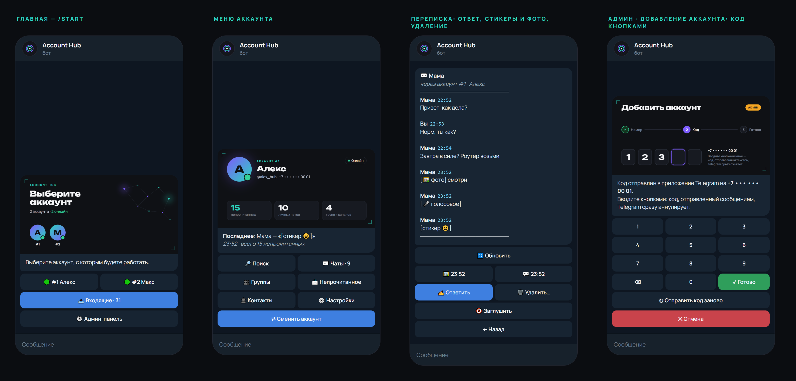

## ✨ Что умеет

- 🗂 **Несколько аккаунтов в одном чате** — выбираешь аккаунт и работаешь от его имени: чаты, группы, каналы, контакты.
- 📥 **Входящие** — непрочитанное со всех аккаунтов одной лентой; заглушённые чаты не мешают.
- ✍️ **Ответы от имени аккаунта** и **«Написать первым»** — по `@username`, ссылке `t.me/…` или из контактов (с суточным лимитом, чтобы не словить спам-блок).
- 🔎 **Поиск** по названиям чатов и тексту сообщений.
- 🗑 **Удаление сообщений** — «у всех» или «только у себя» (в группах — только свои).
- 💬 **Стикеры и фото** из переписки — бот присылает их как есть, по кнопке.
- 👥 **Доступ для других людей** — роли на каждый аккаунт: 👁 чтение или ✍️ чтение и ответы; бан; несколько админов.
- 🔐 **Вход в аккаунт кнопками** — код набирается на кейпаде (Telegram сжигает код, отправленный сообщением); номер и пароль 2FA бот сразу удаляет.
- 📜 **Журнал** — кто что открыл, кому ответил, кому написал первым, что удалил, кому выдал доступ.
- 🟠 **Слетела сессия** — аккаунт помечается «Нужен вход», админам приходит кнопка «Войти заново».

## 📸 Как выглядит

Один экран — одно сообщение: карточка, подпись и кнопки. Бот не засоряет чат, а перерисовывает это сообщение.

| | |
|:---:|:---:|
| **Главная — выбор аккаунта** | **Меню аккаунта** |
| 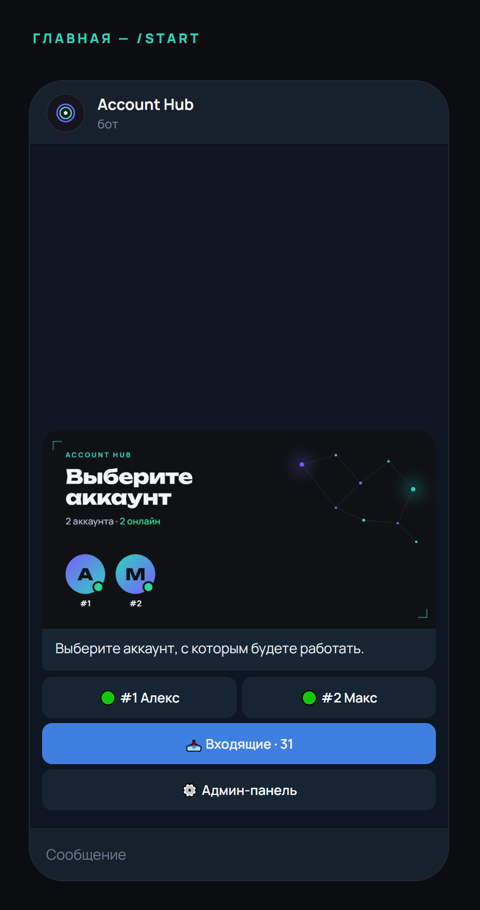 | 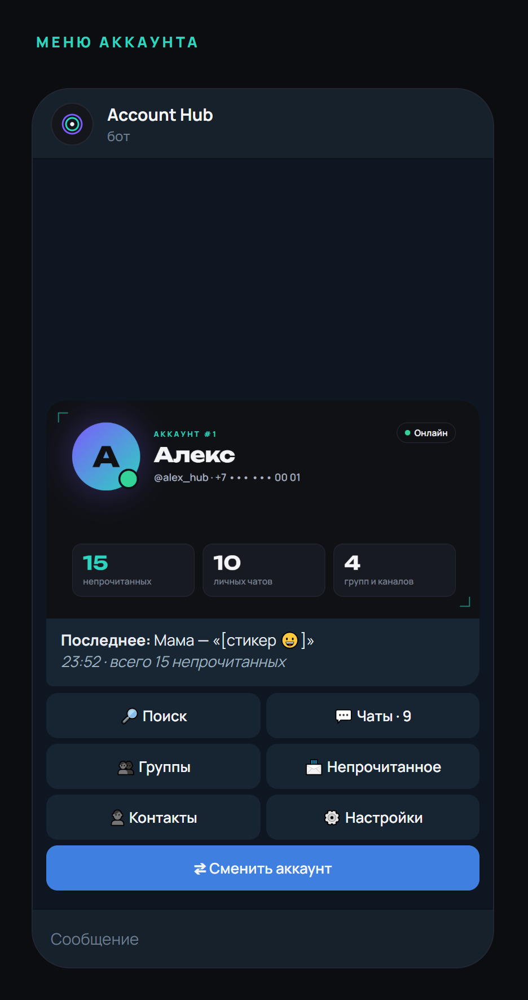 |
| **Чаты аккаунта** | **Переписка: ответ, стикеры и фото, удаление** |
| 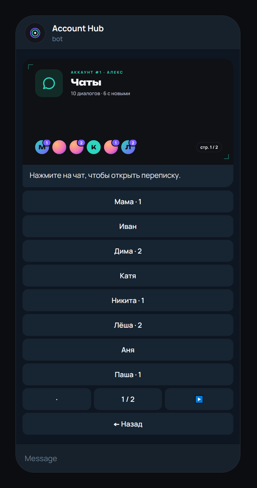 | 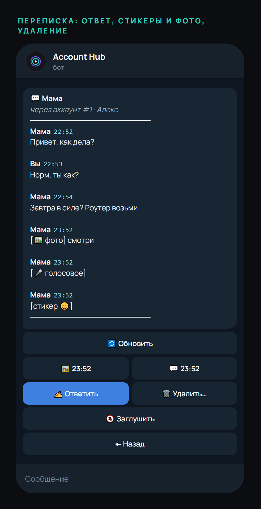 |
| **Удаление сообщения** | **Поиск по @username → написать первым** |
| 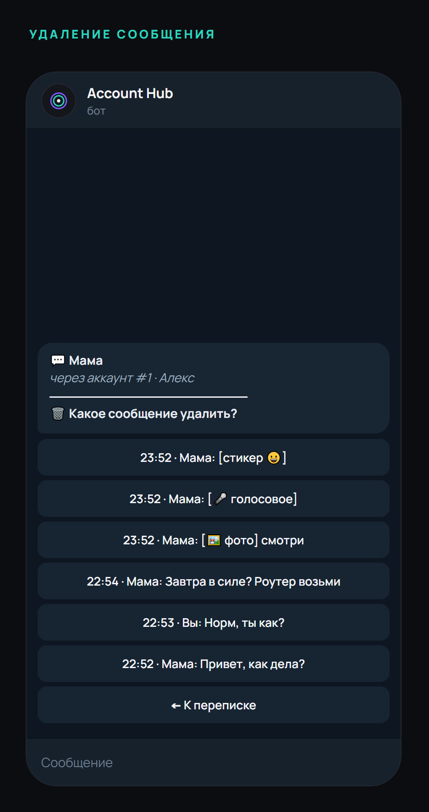 | 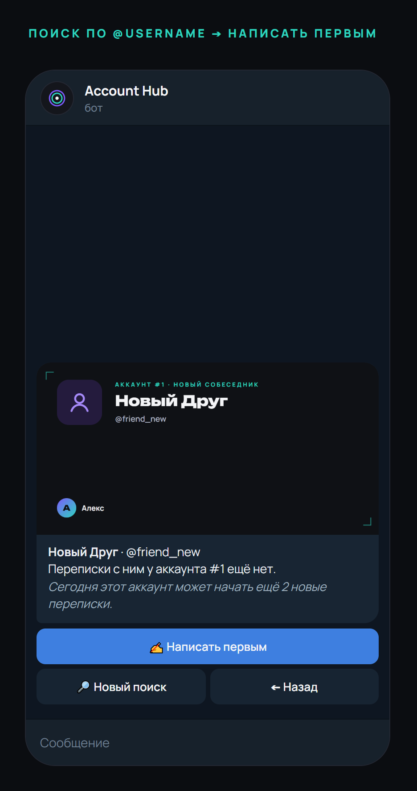 |
| **Добавление аккаунта: код кнопками** | **Входящие со всех аккаунтов** |
| 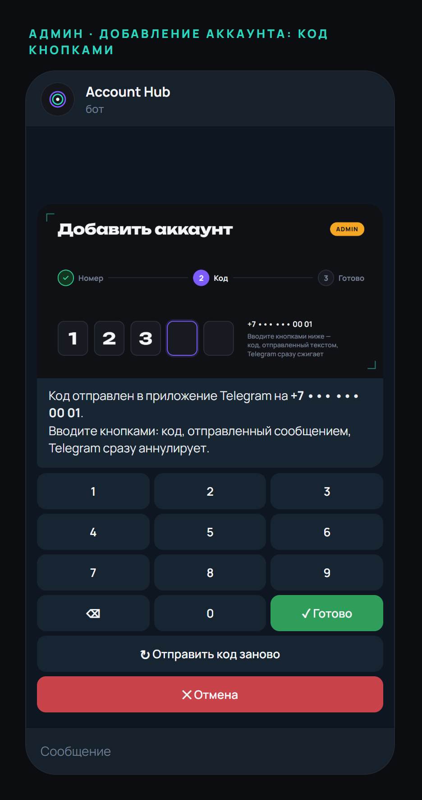 | 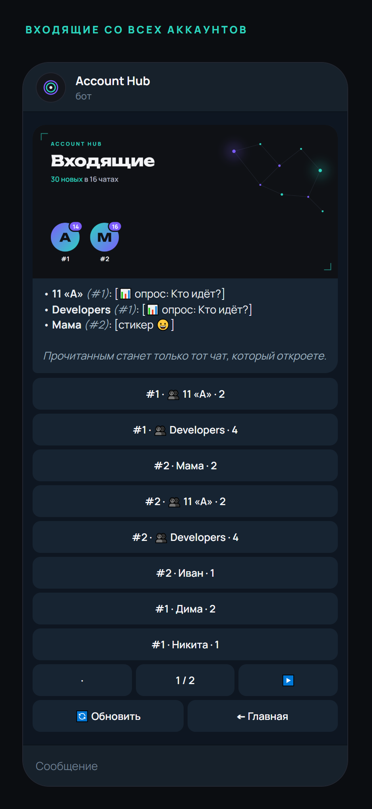 |
| **Админ-панель** | **Доступы пользователя** |
| 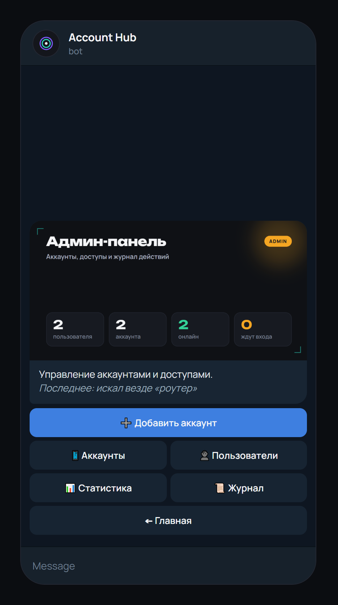 | 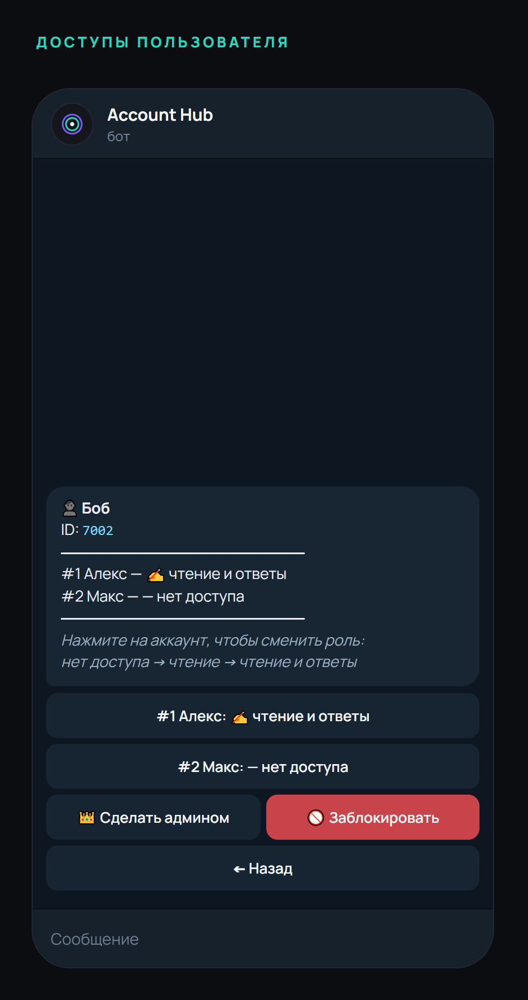 |

<sub>Скриншоты сняты с настоящего кода бота на тестовом стенде — аккаунты и переписки выдуманные. Пересоздать: <code>cd hub && python tests/screenshots.py</code>.</sub>

## 🧩 Как устроено

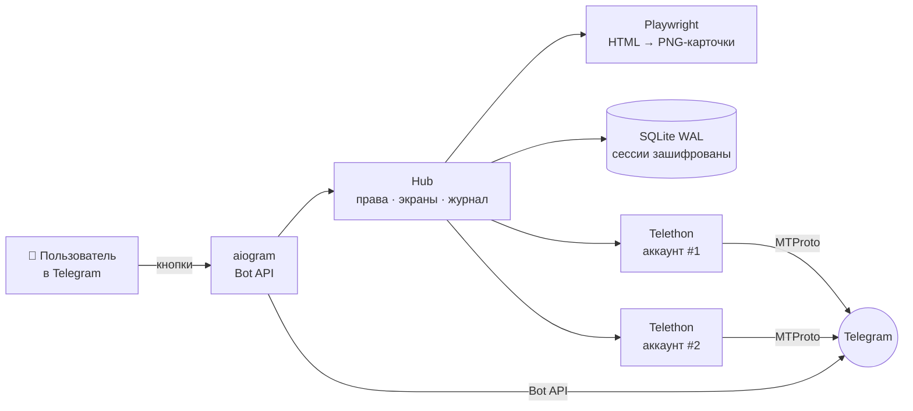

- **Бот и все Telethon-клиенты — в одном asyncio-процессе.** Никаких Redis, очередей и контейнеров: SQLite в режиме WAL.
- **Экран = одно сообщение.** Карточка рендерится из HTML-шаблона (шрифты Unbounded + Manrope) в PNG 1280×640; одинаковые карточки не рендерятся повторно — кэш `file_id` в базе.
- **Права проверяются на каждое нажатие** одной middleware: `account_id` из кнопки всегда сверяется с базой — подделать `callback_data` бесполезно.
- **Бережём аккаунты:** не чаще 1 сообщения в 2 с на аккаунт, лимит новых переписок в сутки, FloodWait и спам-блок показываются понятным текстом.
- **Если Telegram заблокирован у провайдера** — бот и аккаунты ходят через локальный SOCKS5 (клиент Hysteria2 или xray до своего VPN), остальная система — напрямую.

## 🚀 Быстрый старт

Нужны Python 3.12+ и свой `api_id`/`api_hash` с [my.telegram.org](https://my.telegram.org) (API development tools).

```bash
git clone https://github.com/leath0r/account-hub.git
cd account-hub/hub
pip install -r requirements.txt
python -m playwright install chromium   # на Windows вместо этого берётся установленный Edge
cp .env.example .env                     # вписать BOT_TOKEN, API_ID, API_HASH
python main.py
```

Первый админ: впишите свой Telegram ID в `ADMIN_IDS` — или оставьте пустым, и бот напечатает в лог `/claim <код>`: отправьте его боту.
Дальше в боте: **/start → ⚙️ Админ-панель → ➕ Добавить аккаунт**.

### Настройки `.env`

| Переменная | Что | По умолчанию |
|---|---|---|
| `BOT_TOKEN` | токен бота от [@BotFather](https://t.me/BotFather) | — |
| `API_ID`, `API_HASH` | ключ приложения с my.telegram.org | — |
| `ADMIN_IDS` | Telegram ID админов через пробел или запятую | пусто → `/claim` |
| `TZ_OFFSET` | часовой пояс для времени сообщений, часы от UTC | `3` |
| `NEW_CHATS_PER_DAY` | сколько новых переписок аккаунт может начать за сутки, `0` — без лимита | `20` |
| `PROXY` | `socks5://host:port`, если Telegram недоступен напрямую | пусто |
| `SESSION_KEY` | ключ шифрования сессий — **создаётся сам** при первом запуске | — |

## 🖥 Сервер

В `hub/deploy/` — всё для работы на своём Linux-сервере без root:

- **systemd `--user`**: бот (перезапуск без лимита), клиент прокси, ежедневный бэкап базы;
- **`hubctl`** — `status` · `restart` · `logs -f` · `claim` · `env` · `backup` · `selftest` · `proxy set|test|off`;
- **`hubctl proxy set`** принимает ссылку `hy2://`, `vless://` или `trojan://`, сам ставит клиент, проверяет, что Telegram открылся, и только потом перезапускает бота;
- **с Windows-ПК**: `deploy.ps1` — выложить код и перезапустить, `hub.ps1 <команда>` — управлять. Адрес сервера — в `hub/deploy/server.local` (`user@host`, в git не попадает).

## 🧪 Тесты

```bash
cd hub
python tests/run_test.py 1500
```

Стенд подделывает и Telegram (для Telethon), и Bot API (для aiogram) — сеть не нужна, карточки рендерятся по-настоящему. **90 проверок**: вход с кодом и 2FA, FloodWait, роли и подделанные кнопки, слетевшая сессия и перелогин, «Написать первым» и лимит, удаление, стикеры, перезапуск и смена ключа — плюс сотни случайных нажатий. Отдельно ловит то, на чём падает настоящий Telegram: подпись длиннее 1024, текст длиннее 4096, битый HTML, `callback_data` длиннее 64 байт, двойной ответ на кнопку.

## 🔐 Безопасность

- Сессии аккаунтов и номера хранятся в базе **зашифрованными** (Fernet); ключ — только в `.env`.
- Номер телефона и облачный пароль бот **удаляет из чата сразу**; пароль нигде не сохраняется.
- Код входа вводится кнопками и в историю чата не попадает.
- Бот отвечает только в личке и только тем, кому выдан доступ.
- `.env`, база, бэкапы и логи в репозиторий не попадают (`.gitignore`).

> Используйте только со **своими** аккаунтами или с согласия их владельцев и в рамках правил Telegram.

## 📁 Структура

| Путь | Что |
|---|---|
| `hub/` | рабочий бот: `main.py`, `tg.py` (аккаунты), `auth.py` (вход), `access.py` (права), `screens/` (экраны), `templates/` (карточки) |
| `hub/deploy/` | systemd-юниты, `hubctl`, прокси, скрипты выкладки |
| `hub/tests/` | стенд и генератор скриншотов |
| `docs/screenshots/` | картинки для README |
| `demo/` | первое демо интерфейса на выдуманных данных |
| `design/` | макеты карточек |

## 🗺 Дальше

- [ ] пуш-уведомления о новых сообщениях во «Входящие»
- [ ] голосовые, видео и файлы в переписке; отправка фото и файлов из бота
- [ ] настройки уведомлений по чатам, статистика в админке
